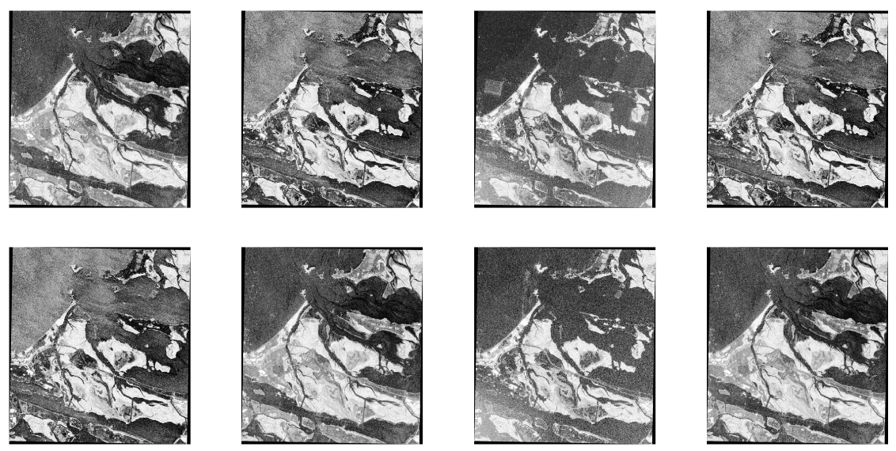

# A Deep-Based Approach for Multi-Descriptor Feature Extraction: Applications on SAR Image Registration #


R2D2 for SAR images
-----------------
This repository contains the reference code for the paper: A Deep-Based Approach for Multi-Descriptor Feature Extraction: Applications on SAR Image Registration


Code needed to train and extract [Fast-R2D2](https://github.com/naver/r2d2) keypoints for SAR images. The data used for training are SAR images from [this](https://www.kaggle.com/datasets/javidtheimmortal/sar-patches) dataset:




Refer to the notebooks for methodology and training of the network.

Check point for SAR is "SAR_R2D2_NewLoss_saved_model_3200.pt" located at models folder.

Please cite with the following BibTeX:

```
@article{norouzi2024,
title = {A Deep-Based Approach for Multi-Descriptor Feature Extraction: Applications on SAR Image Registration},
journal = {Expert Systems with Applications},
volume = {254},
pages = {124291},
year = {2024},
issn = {0957-4174},
doi = {https://doi.org/10.1016/j.eswa.2024.124291},
url = {https://www.sciencedirect.com/science/article/pii/S0957417424011576},
author={Norouzi, Javid and Helfroush, Mohammad Sadegh and Liaghat, Alireza and Danyali, Habibollah},
publisher={Elsevier}
keywords = {Deep learning, Feature detection, Feature description, SAR},
abstract = {Synthetic aperture radar (SAR) images have found increasing attention in various applications, such as remote sensing, surveillance, and disaster management. Unlike optical sensors, SAR can capture images in any weather conditions at any time, making it particularly valuable. However, it poses unique challenges for image processing tasks, like complex speckle noise, texture, and geometric distortions. For many image processing tasks such as image registration; feature detection and extraction are critical initial steps. In this work, we propose a deep learning-based method for detecting and describing keypoints in SAR images, which can be specifically applied to SAR image registration tasks. To address the challenges of SAR images, we utilize the R2D2 network and propose a training scheme specifically tailored for these images. Furthermore, our approach involves multiple descriptors utilization for outlier removal between image keypoints and a two-stage pipeline consisting of coarse and fine stages for robust feature point matching of SAR images. By leveraging the coarse registration stage, which maintains robustness, and also a fine stage that employs multiple descriptors along with a local search technique, our approach enhances the keypoint matching accuracy. Evaluation results show that the proposed method outperforms most of the traditional and deep learning-based methods in terms of the percentage of correct matches, while achieving comparable or even better root mean squared error (RMSE) results.}
}
```
